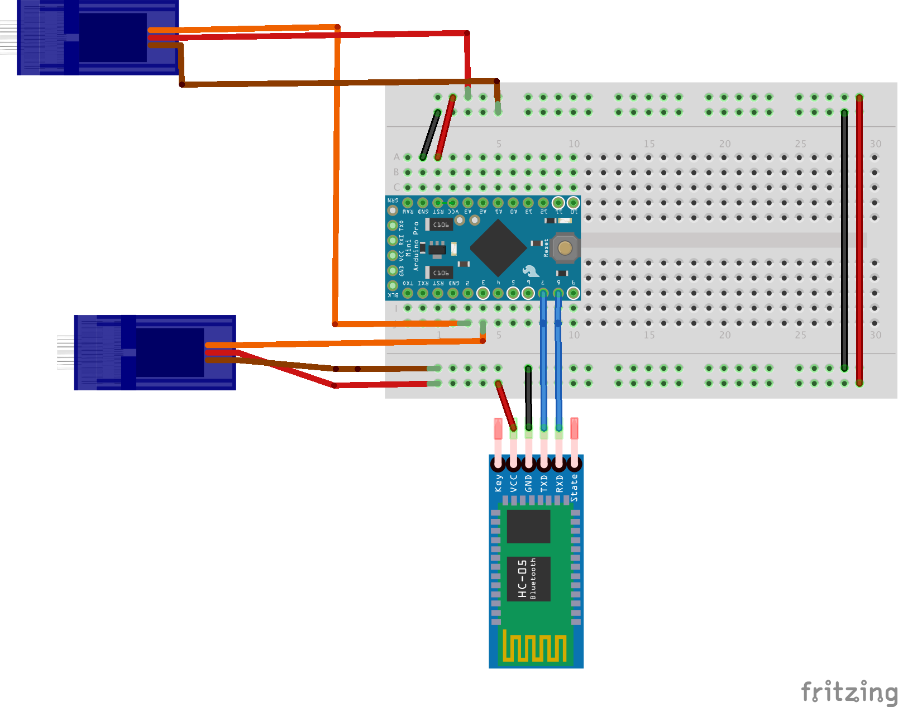

# Audrino program

## Overview
The program is controlled by the HC-06 bluetooth slave. The audrino program loops through and executes a series of actions on the servo.

## Building
The following circuit diagram is used:

Generally, connect the the VCC from the pro-mini to the VCC on the HC-06 module.
Connect the GND pin to the HC-06 module's GND.

Since we are using the Software Serial. We will connect to any of the Pro-mini's digital pins. In this case I connected pin 6 on the pro-mini to the HC-06 TX pin. 

Then connect pin 7 on the pro-mini to the HC-06 RX pin,

If you decide to change any of the pins you will have to change line 13 to the pins you are using.

The servos, are connected to pin's 3 for the eye lids and pin 4 for the eyeball servo controller.  The power pins on the servos are connected to the appropriate VCC and GND pins on the pro-mini microcontroller board.

## Compile 
1. Connect up the FTDI programmer to the pro-mini. [See instructable](https://www.instructables.com/id/Program-Arduino-Pro-Mini-With-FTDI-FT232RL/)

2. Set-up the Audrino IDE to the appropriate board type. Pick Tools -> Board -> "Audrino Pro or Pro mini" .
3. Pick your port, that the FTDI progreamer shows connected to the USB. 

4. Upload the animatronic-eye-ble.ino program.

## Testing
You can connect to the board and see some information via connecting to the Serial Monitor in adrino studio and setting the baud rate to 9600. 

You will need to get the apk installed onto your android phone to connect. See the Android section of this project.
